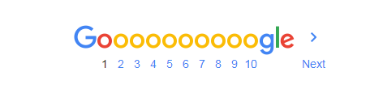
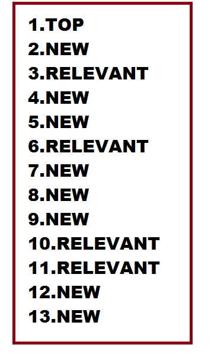

# gRPC Server for the cheroAPI service

This repository contains the implementation for the gRPC services, as defined in [cheroapi.proto](https://github.com/luisguve/cheroproto/blob/master/cheroapi.proto) and [userapi.proto](https://github.com/luisguve/cheroproto/blob/master/userapi.proto), using [Bolt](https://github.com/etcd-io/bbolt), an embedded key/value store as the underlying database.

### Installation

1. run `go get github.com/luisguve/cherosite` and `go get github.com/luisguve/cheroapi`. Then run `go install github.com/luisguve/cherosite/cmd/cherosite` and `go install github.com/luisguve/cheroapi/cmd/...`. The following binaries will be installed in your $GOBIN: `cherosite`, `userapi`, `general` and `contents`. On setup, all of these must be running.
1. You will need to write two .toml files in order to configure the users service and general service and at least one .toml file for a section. Each section should be running on it's own copy of `contents` binary and have it's own .toml file. See userapi.toml, general.toml and section_mylife.toml at the project root for an example.
1. Follow the installation instructions for the http server in the [cherosite project](https://github.com/luisguve/cherosite#Installation).

### Services architecture overview

For the application to work properly, there must be two services running: the users service and the general service, and at least one section service.

##### Users service

This service handles everything related to users on a single Bolt database file. 

It's definition can be found at [userapi.proto](https://github.com/luisguve/cheroproto/blob/master/userapi.proto).

##### General service

This service handles requests that involve getting contents from multiple sections and multiple users, such as the "/explore" page or the dashboard. It does not store any data, but requests it from the APIs of each section and the API of the users service.

It's definition can be fond at [cheroapi.proto](https://github.com/luisguve/cheroproto/blob/master/cheroapi.proto).

##### Section service

This service handles requests of a single section and stores data on a single Bolt database file. It performs one **Quality Assurance** every day automatically, if the variable **schedule_qa** is set to true in the .toml config file for the section.

It's definition can be fond at [cheroapi.proto](https://github.com/luisguve/cheroproto/blob/master/cheroapi.proto).

### An overview of ***cheropatilla***

**Cheropatilla** is a social platform that introduces a pagination system like no other else.

It's features are pretty similar to a regular discussion forum; users can create *posts* in a *section* and other users can leave *replies* on that post or on other replies of the post. So there are three levels of contents: post->comments->subcomments.

Users can also have followers and follow other users so that they can see the recent activity of the users they follow in their homepage (their posts, comments and subcomments).

Nothing new so far.

The feature that differentiates it from the rest is the way it makes **pagination**. Most websites use one of the following techniques:

* **Infinite scrolling 1**; showing contents sequentially in cronological order and requesting more contents as the last one was reached. An example: **Twitter**.
* **Infinide scrolling 2**; showing contents sequentially, using an algorithm as complex as necessary to define the order in which they appear in the screen. For example: **Facebook**.

* **Usual pagination 1**; distributing the content in *pages* and showing a navigation bar at the top or the bottom of the screen. In each page it shows contents sequentially in cronological order, e.g. any blog made in **WordPress**.
* **Usual pagination 2**; showing the same navigation bar in the pages but the contents are placed by order of relevance defined by a complex algorithm. For example: **Google search**

In **Cheropatilla**, all the pagination goes through the button to ***Recycle***. The idea is that when you press the button, a new feed of contents is loaded in a **random fashion**. In order to keep some consistency on the content *quality* across recycles, contents are classified as **new**, **popular** or **top**; then the client must provide a pattern of content quality that the server must fulfill whenever possible. For example:

The order in which the contents are arranged by their status (i.e. *new*, *popular* or *top*) is called ***the pattern***; this is simply a list of content status, specifying the order in which the contents should be returned.

The way in which the contents are returned to make up a feed is completely random; the user enters the page of a section and the server fills the pattern in a random fashion with ***active*** contents from the section. To be exact, this is the algorithm summarized in three steps:

1. Load all the *active* contents from the database into an array.
1. Classify the contents in three categories: *new*, *popular* and *top*.
1. Follow the pattern; on each iteration *i*, take out a content from the category indicated by the pattern (new, popular or top) in a random fashion and insert it into the resulting array.

On the other hand, as the selection of contents must be random for each *feed*, it must be a way to record the contents that the user has already seen and discard them from the set of active contents, in order to have a real pagination in the following feed requests.

The most easy solution is to use cookies. Each time the server sends a *feed* to the client, the session gets updated adding the IDs of the contents that were sent. Each time the client requests a new feed, the server gets the IDs of the contents that were already seen by the user.

Therefore, another step is placed in between the **step 1** and **step 2** from the previous algorithm: the discarding of contents already seen by the user.

The way feeds are requested is through the button ***Recycle***. The contents (and the order) that are obtained by recicling the page is actually unpredictable, but three things can be guaranteed:

1. The top content will **always** be the most popular of all the **active** contents. At the first recycle, the spot of the top content will be taken by the second most popular; at the second recycle, by the third most oustanding and so on in each recycle.
1. The contents received by the client between recycles will **never** be repeated.
1. The server will follow the pattern as much as possible, but in the case in which there are less popular contents than the required by the pattern, their places will be taken by contents classified as new and viceversa.

As I mentioned earlier, the contents are taken from the database only if they're **active**.

There are two contents status: active and archived. Users cannot perform interactions on contents in archived state, and they will not be shown on section feeds.

Once a day, all the contents from all the sections will be analized by an algorithm, which determines whether they are active enough and are still popular at the time. The unactive ones are moved to a place in the database as archived. This process is called ***Quality assurance***.

A piece of content will stay active if it has interactions constantly, and that way it's status changes from new to popular. Are considered as interactions the following events: upvote on post, comment on post, upvote on comment, comment on a comment and upvote on a subcomment.

That's how posts are listed in a section, but other types of contents, such as comments in a post and activities from a user follow the same idea of doing all the pagination of contents through a single button of **recycle**.

Now let's take a look at the levels of contents: post->comment->subcomment.

The idea is that a subcomment is inside of a comment, which in turn is inside of a post (which belongs to a section).

In the view of the post page, the grid of comments begins at the end of the post content and like the contents in a section, they are ordered in a random fashion, following a given pattern, and again, more comments are gotten with the *recycle* button.

The flow is quite different when we're viewing the subcomments of any comment; this is the only content shown sequentially (one below each other) and by chronological order.

There are only two more views: the dashboard and the user profile.

- The dashboard is divided by three sections: recent activity of users followed, own activity and saved posts. All with their own *pattern* and their *recycle* button. Are considered activity posts published, comments and subcomments.
- The user profile lists the recent activity of the user. Again, with its own *pattern* and *recycle* button.

This model of content listing in a random fashion (with the exception of the subcomments), is designed for every post to have the same probabilities to be viewed by all the users, so that ***content discovery*** becomes much more easier.

- Luis Villegas
