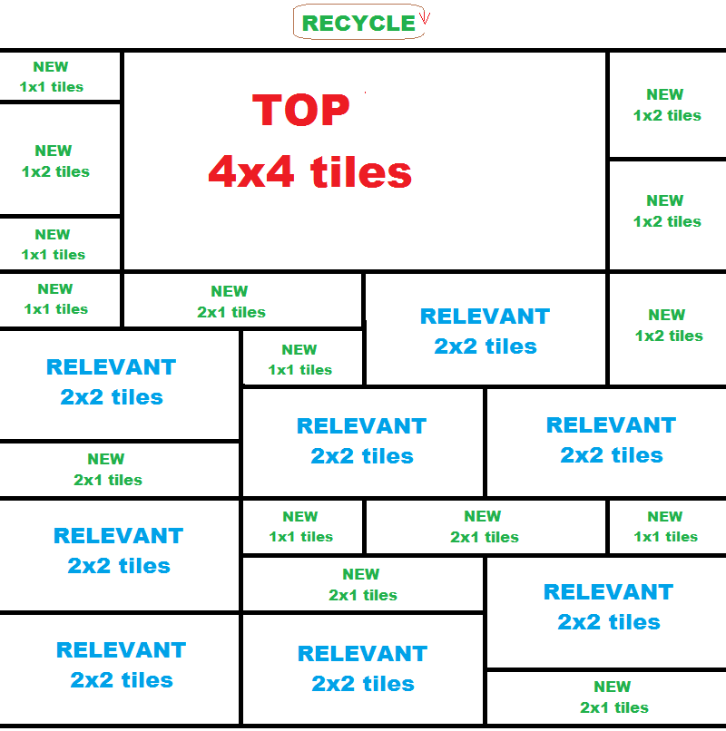

https://t.me/joinchat/OIB-pQ2HzM86gy9DyasWJg

# gRPC Server for the cheroAPI service

This repository contains the implementation for the CrudCheropatilla service, as defined in [cheroapi.proto](https://github.com/luisguve/cheroproto/blob/master/cheroapi.proto), using [Bolt](https://github.com/etcd-io/bbolt), an embedded key/value store as the underlying database.

### An overview of ***cheropatilla***

**Cheropatilla** is a social platform that introduces a pagination system like no other else.

It's features are pretty similar to a regular discussion forum; users can create *posts* in a *section*, other users can leave *replies* on that post or other replies on the post, i.e. there are three levels of contents: post->comments->subcomments.

Users can also have followers and follow other users so that they can see the recent activity of the users they follow in their homepage (their posts, comments and subcomments).

Nothing new so far.

The feature that differentiates it from the rest is the way it makes **pagination**. Most websites use one of the following techniques:

* **Infinite scrolling 1**; showing contents sequentially in cronological order and requesting more contents as the last one was reached. An example: **Twitter**.
* **Infinide scrolling 2**; showing contents sequentially, using an algorithm as complex as necessary to define the order in which they appear in the screen. For example: **Facebook**.
* **Usual pagination 1**; distributing the content in *pages* and showing a navigation bar at the top or the bottom of the screen. In each page it shows contents sequentially in cronological order, e.g. any blog made in **WordPress**.
* **Usual pagination 2**; showing the same navigation in the pages but the contents are placed by order of relevance defined by a complex algorithm. For example: **Google search**

Now how it works in **Cheropatilla**

24 contents per page: 15 of them are new, 8 are relevants and 1 of them is the main content, which turns out to be the most popular at the time. In the frontend, a grid where each content occupies a different number of cells, is rendered as shown in the following picture:

The most **new** contents are placed in the **smaller tiles**, the **outstanding** ones are placed in the **mid-size tiles** and the **main** content is in the **greatest tile**.

The order in which the contents are arranged by their quality is called ***the pattern***.

The way in which the contents are returned is completely random; the user enters the page of a section and the server fills the pattern in a random fashion with ***active*** contents from the section. To be exact, this is the algorithm summarized in three steps:

1. Load all the *active* contents from the database into an array.
1. Classify the contents in three categories: *new*, *outstanding* and *main*.
1. Follow the pattern; on each iteration *i*, take out a content from the category indicated by the pattern (new, outstanding or main) in a random fashion and insert it into the resulting array.

On the other hand, as the selection of contents is random on each *feed*, it must be a way to record the contents the user has already seen and discard them from the set of active contents, in order to have a real pagination in the following feed requests.

The most easy solution is to use cookies. Each time the server sends a *feed* to the client, the session gets updated adding the IDs of the contents that were sent. Each time the client requests a new feed, the server gets the IDs of the contents that were already seen by the user.

Now another step is placed in between the **step 1** and **step 2** from the previous algorithm: the discarding of contents already seen by the user.

The way feeds are requested is through the button ***Recycle***. The contents (and the order) that are obtained by recicling the page is actually unpredictable, but three things can be guaranteed:

1. The main content will **always** be the most outstanding of all the **active** contents. At the first recycle, the spot of the main content will be taken by the second most outstanding; at the second recycle, by the third most oustanding and so on in each recycle.
1. The contents received by the client between recycles will **never** be repeated.
1. The server will follow the pattern as much as possible, but in the case in which there are less outstanding contents than the required by the pattern, their places will be taken by contents classified as new and viceversa.

As I mentioned earlier, the contents are taken from the database only if they're *active*.

There are two states of contents: active and archived. Users cannot perform interactions on contents in archived state, and they will not be shown on section feeds.

Once a day, all the contents from all the sections will be analized by an algorithm, which determines whether they are active enough and are still popular at the time. The unactive ones are moved to a place in the database as archived. This process is called ***Quality assurance***.

A piece of content will stay active if it has interactions constantly, and that way it's status changes from new to outstanding. Are considered as interactions the following events: upvote on post, comment on post, upvote on comment, comment on a comment and upvote on a subcomment.

That's how posts are listed in a section, but other types of contents, such as comments in a post and activities from a user follow the same idea of reducing the pagination of contents to a single button of **recycling**.

___

Sus caracteristicas son similares a las de un foro de discusión; usuarios crean posts en una sección y otros usuarios los ven en la página de la seccion, pueden entrar en la página del post, dejar un comentario, o responder un comentario del post. Es decir, hay hasta tres niveles aqui: post->comentario->subcomentario. 

También los usuarios pueden tener seguidores y seguir a otros usuarios; cuando entran en su dashboard, pueden ver la actividad reciente de los usuarios que siguen (sus posts, comentarios y subcomentarios). En ese sentido, es parecido al timeline de Twitter.

Hasta ahora, nada nuevo.

La caracteristica que lo diferencia del resto es la forma en la que hace la paginación de los contenidos. La mayoria de los sitios utilizan una de las siguientes técnicas:

* Infinite scrolling, mostrando los posts secuencialmente por orden cronológico; desde los más recientes (arriba) hasta los más antiguos (abajo). Es lo que hace Twitter.
* Infinite scrolling, secuencialmente utilizando un algoritmo tan complejo como sea necesario para definir el orden en el que se muestran los posts, de manera que el usuario vea primero los mas importantes (Facebook).
* Paginación tradicional, distribuye el contenido en paginas (1,2,3...) y muestra una barra al comienzo o al final de la pagina, y en cada pagina muestra resultados secuencialmente, en orden cronológico. Es lo que se ve en cualquier blog.
* Paginación tradicional, que muestra la misma barra de navegación entre páginas pero los contenidos se arreglan por orden de relevancia utilizando un algoritmo (Google).

Ahora como funciona en Cheropatilla:

24 contenidos por página: 15 nuevos, 8 relevantes y 1 principal. En el frontend se forma una grilla donde cada contenido ocupa un numero de celdas diferentes (ver imagen) y tiene la muestra de un post en el (lo típico: título, featured file y un resumen). Los más nuevos están en las celdas más pequeñas, los relevantes en las celdas medianas y el principal está en la celda más grande. El orden en el que se arreglan los contenidos dependiendo de su calidad es lo que llamo "el patrón".

La forma en la que se obtiene el feed (los 24 contenidos) es completamente aleatoria. El usuario entra en la página de una sección y el servidor rellena el patrón aleatoriamente con contenidos "activos" de la sección. Para ser exactos, este es el algoritmo (resumido en tres pasos):

1. Carga todos los contenidos *activos* de la base de datos a un arreglo.
2. Clasifica los contenidos en tres categorías: nuevo, relevante y principal.
3. Recorre el patrón; en cada iteración *i*, saca un contenido aleatoriamente de la categoría del tipo que indica el patrón (nuevo, relevante o principal) y se inserta en el arreglo resultante.

Por otro lado, como la seleccion de los contenidos es aleatoria en cada feed, debe haber una manera de registrar los contenidos que el usuario ya ha visto, y descartarlos del set de contenidos activos (para cada usuario) para que exista una verdadera paginación en las proximas peticiones de feed.

Las cookies son la solucion mas sencilla aquí. Cada vez que el servidor envía un feed al cliente, se actualiza la sesion agregando los IDs de los contenidos que fueron enviados. Cada vez que el cliente pide otro feed, el servidor obtiene los IDs de los contenidos que ya fueron vistos por el usuario.

Ahora entre el paso 1 y el paso 2 del algoritmo anterior, tiene lugar otro proceso: el descarte de contenidos ya vistos por el usuario.

La manera en la que se obtiene otro feed es con el boton "Recycle". Realmente los contenidos (y el orden) que se obtienen al reciclar la pagina es impredecible, pero sí se pueden asegurar tres cosas:

1. El post principal siempre será el más relevante de todos los contenidos activos. En el primer recycle, el espacio del post principal lo va a tomar el segundo más relevante, en el segundo recycle, el tercero más relevante y asi con cada recycle.
2. Nunca se van a repetir los contenidos que recibe el cliente entre recycles.
3. El servidor hará todo lo posible por respetar el patrón, pero en el caso de que hayan menos contenidos relevantes que los requeridos por el patrón, en su lugar se tomarán contenidos de la lista de nuevos. Mismo caso cuando hay menos contenidos nuevos que los requeridos por el patrón; se toman de la lista de contenidos relevantes.

Antes mencioné que los contenidos se toman de la base de datos solo si estan activos...

Hay dos tipos de contenidos: los activos y los archivados. Tal y como funciona en Reddit, no se puede interactuar con un contenido en estado archivado, y no se mostrarán en el feed de las secciones. Es una manera de hacer limpieza y mantener a la vista del usuario solo los posts más recientes y relevantes.

Una vez al dia, un script se encarga de analizar todos los posts en todas las secciones y determina si tienen suficiente actividad y siguen siendo relevantes. Los inactivos (aquellos que no cumplen el criterio) se mueven todos a una parte de la base de datos como archivados. Este proceso lo llamo Control de calidad o QA (Quality Assurance).

Un contenido se mantiene activo si tiene interacciones constantemente, y de esa forma cambia de status (nuevo -> relevante). Se consideran interacciones los siguientes eventos: voto positivo en post, comentario, voto positivo en comentario, subcomentario y voto positivo en subcomentario.

Hasta ahora esta es solo la presentación de los contenidos dentro de una sección, pero las otras partes tienen practicamente la misma lógica y el mismo objetivo de reducir la acción de paginación de contenidos a un botón de reciclaje.

Ahora hablemos de los niveles de contenido: post->comentario->subcomentario.

La idea es que un subcomentario está dentro de un comentario, el cual está dentro de un post (el cual pertenece a una sección).

En la vista de la página del post, la grilla de comentarios comienza donde termina el post, y al igual que los contenidos en una sección, están ordenados aleatoriamente siguiendo un patrón determinado, y de nuevo, se obtienen más comentarios con el botón de reciclaje.

La cosa cambia cuando estamos en la sección de subcomentarios. Este es el único contenido que se presenta secuencialmente (uno abajo de otro) y por orden cronológico. Entonces tiene sentido que sea el único lugar donde pueda haber una conversación entre varios usuarios, formando así un hilo.

Solo hay dos vistas más: el dashboard y el perfil de usuario.

El dashboard se divide en tres secciones: actividad de usuarios seguidos, actividad propia y posts guardados. Todos con su propio patrón y su boton de reciclaje. Cuentan como actividad los posts creados, comentarios y subcomentarios hechos.

El perfil de usuario presenta los contenidos activos del usuario. De nuevo, con su propia grilla y botón de reciclaje.

Este modelo de presentación de contenidos de forma aleatoria (a excepción de los subcomentarios) está diseñado para que todos los posts tengan las mismas probabilidades de ser percibidos por todos los usuarios, pero al mismo tiempo manteniendo la representación de relevancia, asignando a cada post un lugar especifico en la grilla dependiendo de su actividad.

¿Por que creo que puede ser un exito comercial?

Una de las razones es porque es diferente a lo que estamos acostumbrados, pero la razon principal es porque sus aplicaciones se pueden extender más alla de ser el motor de una red social; otros sitios web podrian adoptarlo para presentar sus contenidos, o simplemente como sistema de comentarios en sus contenidos. Me gusta compararlo con WordPress en ese sentido de versatilidad.

Adicionalmente, tiene potencial para adoptar una temática de sandias (de ahi la palabra patilla) y utilizar términos relacionados, como Rama para referirse a post y Patillavatar para referirse a foto de perfil (se aceptan sugerencias).

¿Por que Chero? puede ser un nuevo término, un saludo... Chero everyone!

---

Sean bienvenidos al equipo de desarrollo de Cheropatilla, una plataforma social que introduce un sistema de paginación de contenido como ningun otro.

Este grupo será para organizar ideas sobre las caracteristicas del sistema y los detalles de su implementación, compartir sugerencias para que el resto de los integrantes den su punto de vista y aclarar dudas sobre el codigo fuente.

Por aqui solo se compartirá informacion que el resto del equipo deba saber; anuncios sobre el estado del desarrollo, todas las decisiones que se tomen y recomendaciones sobre cambios que puedan considerarse radicales. En otras palabras, el grupo es solo para publicaciones importantes.

También es válido compartir material referente a temas de programación y diseño web, como tutoriales y mejores prácticas, pero estas publicaciones deben estar acompañadas con una propuesta para mejorar o desarrollar algo.

El resto de la comunicación será a través del grupo en Telegram: https://t.me/cherodevelopers, donde podrán plantear sus dudas y compartir sus ideas de forma mas rápida.

Mi experiencia en programación es poca; he sido programador aficionado durante los ultimos dos años. Asi que este inicié este proyecto principalmente para adquirir experiencia, pero no abandono la idea de que pueda convertirse en un éxito comercial por su originalidad.

Este es un proyecto amateur: no contamos con ningun tipo de financiamiento. En este equipo se admiten profesionales y aficionados de las tecnologias informaticas y el diseño web, con o sin experiencia. El unico requisito indispensable es la disposición a aportar ideas, compartir conocimientos y experiencia.

- Luis Villegas
